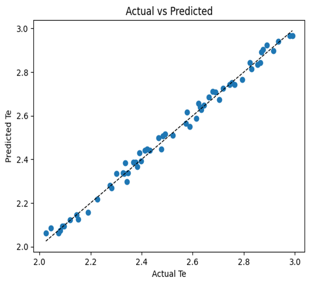

# Machine Learning Assisted Plasma Diagnostics

> Physics-Informed Machine Learning | Indian Institute of Technology Roorkee

## Project Overview

This project explores the application of **Machine Learning** to accelerate plasma diagnostics by combining **physics-based simulations** with **Random Forest Regression**.

A **Collisional-Radiative (CR) model** was first used to generate synthetic emission spectra of singly ionized aluminium (Al II) under different plasma conditions. These spectra were then used to train a supervised machine learning model capable of predicting **electron temperature** directly from spectral intensities.

The objective is to replace computationally intensive CR-model calculations with a fast and accurate ML-based prediction pipeline.

---

## Objectives

- Generate synthetic plasma spectra using a Collisional-Radiative model.
- Build a labeled dataset for supervised learning.
- Train a Random Forest Regression model.
- Predict plasma electron temperature from emission spectra.
- Demonstrate a physics-informed machine learning workflow.

---

## Tech Stack

- Python
- NumPy
- Pandas
- Scikit-learn
- Matplotlib
- Jupyter Notebook
- Flexible Atomic Code (FAC)

---

## Workflow

```text
Physics-Based Simulation (CR Model)
                │
                ▼
Synthetic Spectral Dataset
                │
                ▼
Feature Engineering
(Normalized Intensities)
                │
                ▼
Random Forest Regression
                │
                ▼
Electron Temperature Prediction
```

---

# Machine Learning Pipeline

Instead of repeatedly solving computationally expensive Collisional-Radiative equations for every plasma condition, a Random Forest Regression model learns the relationship between normalized spectral intensities and electron temperature.

Once trained, the model predicts plasma parameters directly from spectral data, significantly reducing computation time while maintaining high accuracy.

---

# Model Performance

The Collisional-Radiative (CR) model provides accurate plasma diagnostics but requires solving complex coupled rate equations for every new plasma condition, resulting in significant computational overhead.

To improve computational efficiency, a **Random Forest Regression** model was trained on CR-model-generated synthetic spectra. The trained model learns the relationship between normalized spectral intensities and electron temperature, enabling rapid parameter estimation without repeatedly solving the underlying physics-based equations.


<p align="center">
  
</p>


### Performance Metrics

| Metric | Value |
|---------|------:|
| Model | Random Forest Regression |
| R² Score | **0.9927** |
| Mean Squared Error | **5.25 × 10⁻⁴** |

---

## Key Findings

- Achieved an **R² score of 0.9927**, indicating excellent predictive performance.
- The predicted temperatures closely match the true values, demonstrating strong model generalization.
- The low Mean Squared Error (**5.25 × 10⁻⁴**) reflects minimal prediction error.
- The trained model significantly reduces computation time compared to traditional simulation-based diagnostics.
- Demonstrates how **physics-informed machine learning** can accelerate scientific workflows while preserving prediction accuracy.

---

# Project Highlights

- Developed a **physics-informed machine learning pipeline** for plasma diagnostics.
- Generated synthetic training data using a Collisional-Radiative model.
- Engineered spectral intensity features for regression modeling.
- Built and evaluated a Random Forest Regression model.
- Achieved **R² = 0.9927** with low prediction error.
- Demonstrated the potential for rapid, data-driven plasma parameter estimation.

---

## ⚠️ Note

This repository contains the machine learning workflow, and visualizations.

The complete Flexible Atomic Code (FAC) implementation and research simulation source code are not included, as they form part of ongoing academic research.
