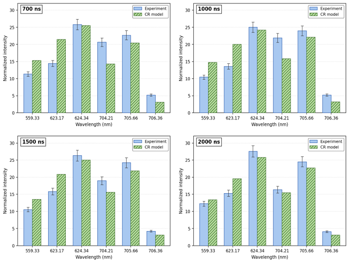
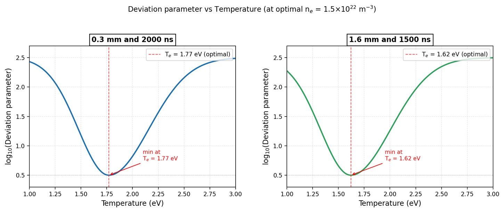

# Machine Learning Assisted Plasma Diagnostics using Collisional-Radiative Modeling

> Undergraduate Research Project | Indian Institute of Technology Roorkee

## Project Overview

This project presents a **physics-informed machine learning workflow** for plasma diagnostics by combining a **Collisional-Radiative (CR) model** with **Random Forest Regression**.

A CR model was developed to simulate emission spectra of singly ionized aluminium (Al II) plasma under different plasma conditions. The generated synthetic spectra were validated against experimental observations and subsequently used to train a machine learning model for rapid electron temperature prediction.

Unlike conventional plasma diagnostics that repeatedly solve computationally expensive CR equations, the trained ML model predicts plasma parameters directly from spectral intensities, enabling significantly faster diagnostics.

---

## Objectives

- Develop a Collisional-Radiative (CR) model for Al II plasma.
- Compare theoretical emission spectra with experimental measurements.
- Estimate plasma electron temperature using deviation parameter analysis.
- Generate a synthetic spectral dataset for machine learning.
- Train a Random Forest Regression model for rapid electron temperature prediction.
- Demonstrate a physics-informed approach for accelerated plasma diagnostics.

---

## Tech Stack

- Python
- NumPy
- Pandas
- Matplotlib
- Scikit-learn
- Jupyter Notebook
- Flexible Atomic Code (FAC)

---

## 🔄 Project Workflow

```text
Experimental Spectra
        │
        ▼
Collisional-Radiative Model
        │
        ▼
Synthetic Spectral Database
        │
        ▼
Feature Engineering
(Normalized Line Intensities)
        │
        ▼
Random Forest Regression
        │
        ▼
Electron Temperature Prediction
```

---

#  Results & Insights

## 1️⃣ CR Model Validation

<p align="center">

</p>

### Why is this important?

Before applying machine learning, the underlying physics model must accurately reproduce experimental plasma behavior. This comparison validates the reliability of the generated synthetic data.

### Key Insights

- The CR model closely follows the experimental normalized emission spectra across all delay times (700–2000 ns).
- Strong transitions such as **624.34 nm** and **705.66 nm** are accurately reproduced.
- Minor deviations are expected due to experimental uncertainties and modeling approximations.
- The close agreement confirms that the generated spectra are physically meaningful and suitable for machine learning.

### Impact

✔ Validates the accuracy of the physics-based model.

✔ Reduces dependence on large experimental datasets by generating reliable synthetic training data.

---

## 2️⃣ Electron Temperature Estimation

<p align="center">

</p>

### Why is this important?

Electron temperature is one of the most critical plasma parameters.

Instead of manually estimating it, the deviation parameter identifies the temperature at which the theoretical spectrum best matches the experimental observations.

### Key Insights

- The deviation curves exhibit a clear global minimum.
- Estimated electron temperatures:
  - **1.77 eV** at **0.3 mm, 2000 ns**
  - **1.62 eV** at **1.6 mm, 1500 ns**
- The sharp minima demonstrate the sensitivity of spectral intensities to changes in electron temperature.

### Impact

✔ Enables accurate plasma diagnostics using spectroscopy.

✔ Generates labeled data required for supervised machine learning.

---

## Physics-Informed Machine Learning

<p align="center">

</p>

### Why Machine Learning?

Although the CR model provides accurate plasma diagnostics, solving coupled population balance equations for every new plasma condition is computationally intensive.

To overcome this limitation, CR-model-generated synthetic spectra were used to train a **Random Forest Regression** model that learns the relationship between normalized spectral intensities and electron temperature.

Once trained, the model predicts electron temperature directly from spectral data without repeatedly solving the CR equations.

### Model Performance

| Metric | Value |
|---------|------:|
| Model | Random Forest Regression |
| R² Score | **0.9927** |
| Mean Squared Error | **5.25 × 10⁻⁴** |

### Key Insights

- Predicted temperatures closely align with the actual values, indicating excellent predictive performance.
- The near-diagonal distribution demonstrates minimal prediction error across the test dataset.
- The Random Forest model effectively captures the nonlinear relationship between spectral intensities and electron temperature.

### Impact

✔ Eliminates repeated computationally expensive CR-model simulations.

✔ Enables significantly faster plasma parameter estimation.

✔ Demonstrates the feasibility of real-time plasma diagnostics using physics-guided machine learning.

---

# Project Highlights

- Developed a **Collisional-Radiative (CR) model** for Al II plasma diagnostics.
- Validated theoretical emission spectra against experimental observations.
- Generated a synthetic spectral dataset using physics-based simulations.
- Built a **Random Forest Regression** model for plasma electron temperature prediction.
- Achieved **R² = 0.9927** with low prediction error.
- Demonstrated a **physics-informed machine learning pipeline** for accelerating plasma diagnostics.


## ⚠️ Note

This repository includes:

- Data visualization notebooks
- Machine learning workflow
- Processed datasets
- Research figures

The complete **Flexible Atomic Code (FAC)** implementation and research simulation source code are **not included**, as they form part of ongoing academic research.

---

## 👩‍💻 Author

**Sireesha Teegala**

B.Tech, Indian Institute of Technology Roorkee
